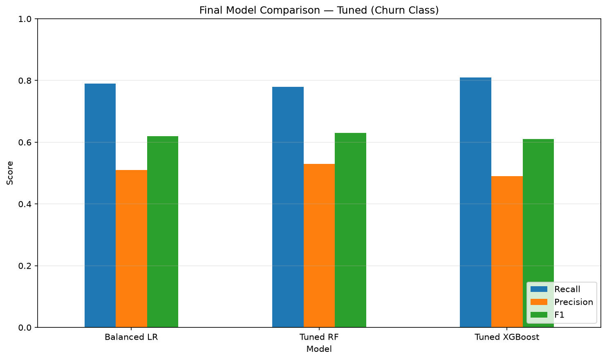
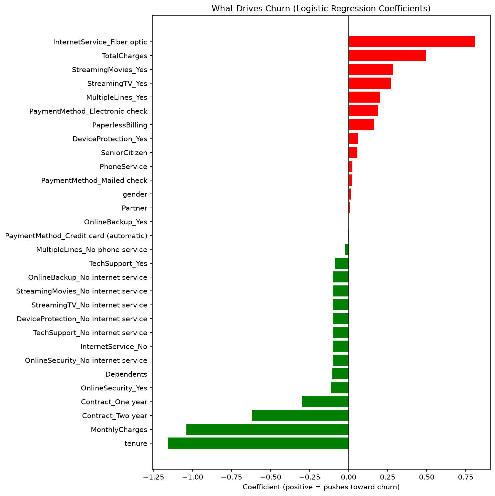
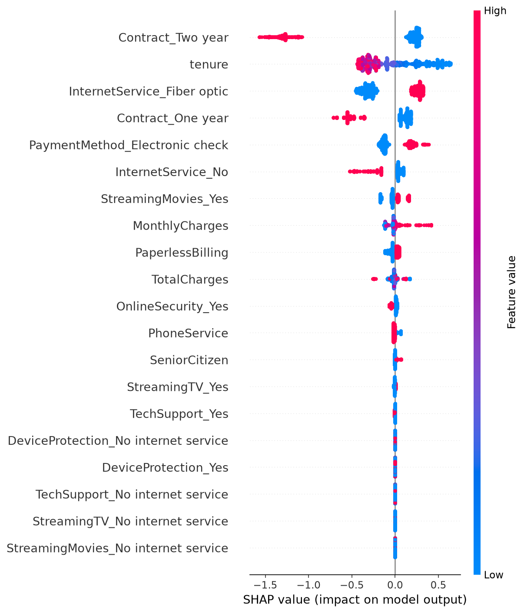

# Customer Churn Prediction

A machine learning system that predicts which telecom customers are likely to cancel their service, built end to end from raw data to a deployed API running in a Docker container.

The focus of this project is not chasing the highest accuracy number. It is understanding **where the model fails, what those failures cost the business, and why a simpler model can be the right choice.**

---

## Headline result

**Live API:** https://customer-churn-prediction-25yg.onrender.com/docs

*Hosted on a free tier, so the first request after a period of inactivity may take up to a minute while the server wakes up.*

The final model catches **79% of customers who actually churn** (recall on the churn class), using a Balanced Logistic Regression.

A more complex tuned XGBoost model reached 81% recall, but only by a margin of 0.02 after a 60-configuration grid search, and it lost on F1 score. The simpler model was chosen because it is easier to interpret, faster to run, and simpler to deploy, while performing within a hair of the complex one.



---

## Why recall, not accuracy

The dataset is imbalanced: about 73% of customers stay and 27% churn. A model that blindly predicts "no churn" for everyone would score 73% accuracy while being completely useless, because it would never catch a single churner.

For a churn problem, the cost of missing a churner (losing a customer) is much higher than the cost of a false alarm (offering a retention discount to someone who was going to stay anyway). That makes **recall** the metric that actually maps to business value, so the whole project is scored and tuned around it.

---

## Key findings

**Fiber optic internet is the strongest independent driver of churn.** This held up across four separate methods: exploratory analysis, model coefficients, SHAP summary values, and individual SHAP explanations. Even after accounting for monthly charges, fiber customers churn more, which points to a real product or experience issue rather than just a price effect.

**Contract type and tenure are the biggest protectors.** Customers on two-year contracts and those who have been around longer are far less likely to leave. New month-to-month customers are the highest risk.



**Simple models tied complex ones.** After full hyperparameter tuning, the top three models finished in a statistical dead heat. Complexity did not automatically win.

SHAP values were used to confirm these drivers independently of the model coefficients, and to explain individual predictions rather than just overall trends.



---

## Approach

1. **Exploratory data analysis** to understand the data and spot the class imbalance early
2. **Cleaning and encoding**, including fixing a hidden data type bug where total charges were stored as text
3. **Baseline modeling** with logistic regression
4. **Model comparison and tuning** across Logistic Regression, Random Forest, and XGBoost, scored on recall
5. **Interpretability** using model coefficients and SHAP
6. **Deployment** as a FastAPI service, then packaged into a Docker container

---

## Tech stack

- **Language:** Python
- **ML:** scikit-learn, XGBoost, SHAP
- **Data:** pandas, numpy
- **API:** FastAPI, uvicorn
- **Packaging:** Docker
- **Notebooks:** Jupyter

---

## How to run it

### Option 1: Docker (recommended)

Requires Docker Desktop installed and running.

```bash
git clone https://github.com/awe-builds/customer-churn-prediction.git
cd customer-churn-prediction
docker build -t churn-api .
docker run -p 8000:8000 churn-api
```

Then open `http://127.0.0.1:8000/docs` in your browser to test the API through the interactive docs.

### Option 2: Run locally without Docker

```bash
git clone https://github.com/awe-builds/customer-churn-prediction.git
cd customer-churn-prediction
python -m venv venv
venv\Scripts\activate
pip install -r requirements.txt
python -m uvicorn app:app --reload
```

Then open `http://127.0.0.1:8000/docs`.

### Making a prediction

Send a POST request to `/predict` with a JSON body containing 30 feature values:

```json
{"features": [1.0, 0.0, 1.0, 1.0, 72.0, 1.0, 1.0, 114.05, 8468.2, 0.0, 1.0, 1.0, 0.0, 0.0, 1.0, 0.0, 1.0, 0.0, 1.0, 0.0, 1.0, 0.0, 1.0, 0.0, 1.0, 0.0, 1.0, 1.0, 0.0, 0.0]}
```

The API returns a prediction and a churn probability:

```json
{"churn_prediction": 0, "churn_probability": 0.118}
```

---

## Dataset

Telco Customer Churn dataset (7,043 customers, fictional US telecom). Each row is a customer with their account details, services, and whether they churned.

---

## What I would do next

- Add input validation so the API returns a clear error for malformed requests instead of a generic failure
- Monitor for data drift, since a churn model degrades as customer behavior shifts over time
- Experiment with adjusting the decision threshold in production to trade off recall against the cost of retention offers

---

## Notes from building this

This was my first end-to-end ML project. The hardest part was not the modeling, it was deployment. I hit a version-mismatch bug where the API loaded an older scikit-learn than the one that trained the model, which broke predictions with a confusing error. Tracking it down to two different Python environments on the same machine, and fixing it, taught me more about why reproducibility and pinned dependencies matter than any tutorial could have. Docker is the permanent fix for exactly that class of problem, which is why the project ships as a container.
